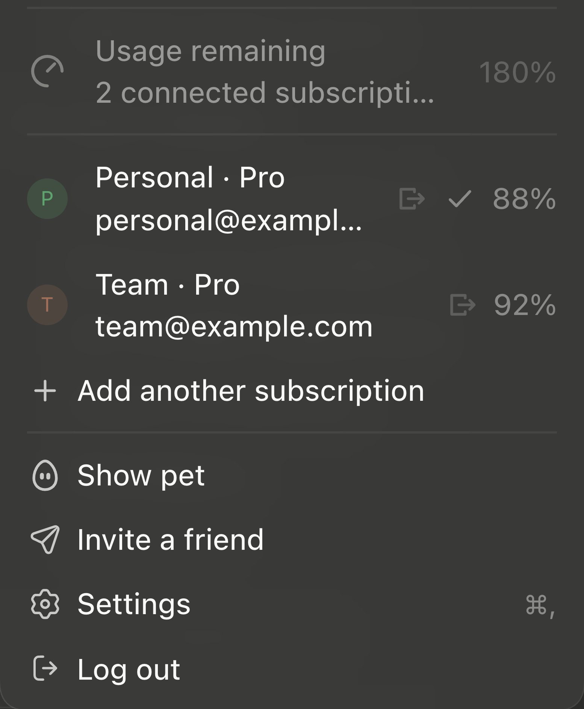

# Codex++

Multiple ChatGPT subscriptions in one Codex desktop app.

Codex++ installs a second app next to `ChatGPT.app` without touching the
original. Every subscription you connect shows up in the profile menu with its
own avatar, plan and remaining usage. Click a row to switch the whole app to
that account — history, projects and skills stay shared.



The original app is left exactly as it is: signature, auto-update and keychain
access all keep working. You can go back to it whenever you want.

## Install

```bash
./install.sh install
```

Requirements: macOS, Xcode Command Line Tools (`clang`), an installed
`ChatGPT.app`.

Uninstall:

```bash
./install.sh uninstall
```

## Using multiple accounts

Open the profile menu in the sidebar footer:

- **Usage remaining** — the combined headroom across every connected
  subscription, shown when you have more than one.
- **Account rows** — avatar, label, plan and that account's own remaining
  usage. A check marks the account the engine is currently using. Click a row
  to switch to it.
- **Log out icon** — signs out of that single account. If it was the active
  one, the app keeps running on the next remaining account instead of dropping
  you at the sign-in screen.
- **Add another subscription** — opens the ChatGPT login flow and stores the
  new account.

You can also add an account from the terminal:

```bash
node tools/add-account.mjs "Work"
```

The account you pick is remembered and restored the next time the app starts.

## Configuration

Everything is set through environment variables:

| Variable | Default |
|---|---|
| `SRC_APP` | `/Applications/ChatGPT.app` |
| `DEST_APP` | `/Applications/Codex++.app` |
| `BUNDLE_ID` | `com.local.codexpp` |
| `USER_DATA_DIR` | `~/Library/Application Support/CodexPP` |
| `CODEX_HOME_SHARED` | `~/.codex` |

`CODEX_HOME` is deliberately **shared** with the original app so thread
history, projects and skills carry over. `USER_DATA_DIR` is separate — without
it the two apps collide on Electron's single-instance lock.

## How it works

The app is Electron (`app.asar`); the engine is a separate `codex app-server`
process and the two speak JSON-RPC.

Installing does this:

1. Copy the bundle with `ditto`
2. Rewrite `CFBundleIdentifier`, `CFBundleName`, `CFBundleExecutable`
3. Compile `src/launcher.c` and make it the main executable
4. Drop `embedded.provisionprofile` and the old signature
5. Ad-hoc sign inside out

### Account switching

The engine supports an auth mode where the host app supplies ChatGPT tokens
instead of managing them itself (`chatgptAuthTokens`). The stock desktop app
never uses it — it only ever sends `{type:"chatgpt"}` and lets the engine read
`~/.codex/auth.json`. That single file is why the stock app has exactly one
account, and why logging out signs you out of everything.

Codex++ takes over that channel:

- A side process (`hub/`) keeps a store of accounts and their refresh tokens
  under `USER_DATA_DIR`, and mints access tokens on demand.
- The account in `~/.codex/auth.json` is read live as the *native* account, so
  the account you already signed in with shows up without being copied
  anywhere.
- Picking an account sends `account/login/start {type:"chatgptAuthTokens"}` to
  the engine. The switch is immediate, needs no logout, and never writes to
  `~/.codex/auth.json`.
- When the engine hits a 401 it asks the host to refresh; the hub answers with
  a fresh token for the account currently in use.

Per-account usage comes from the engine too, not from a web endpoint: the hub
spawns a short-lived `codex app-server` in a temporary `CODEX_HOME`, logs into
each account in turn with its own token, and reads
`account/rateLimits/read`.

### Why a launcher is needed

The `userData` directory can only be changed through Chromium's
`--user-data-dir` switch. The `CODEX_ELECTRON_USER_DATA_PATH` variable in the
code is read but has no effect:

```
ERROR:owl/browser/api/electron_api_app.cc:792
Ignoring late userData path change after native startup.
```

`app.setPath('userData')` is called after native startup, so OpenAI's Electron
fork refuses it. Since arguments cannot be put in `Info.plist`, and the
hardened runtime will not accept a shell script as the main executable
(`Launchd job spawn failed`, POSIX 162), a small Mach-O launcher is required.

### Signing

Ad-hoc signature. Restricted entitlements (`keychain-access-groups`,
`application-groups`, `aps-environment`, `application-identifier`) are dropped —
they are bound to OpenAI's team id and cannot be transferred. What is lost:
push notifications and two app-group services.

`Codex++-bin` must be signed with entitlements, otherwise library validation
refuses to load `Codex Framework` (*different Team IDs*).

### Auto-update

Turned off with `CODEX_SPARKLE_ENABLED=false`, otherwise the fork updates
itself and the patches are gone. Re-run `install.sh install` after the original
app updates.

## Patches

The patched surface is kept small — everything else lives in `hub/` as ordinary
code.

| # | File | Job |
|---|---|---|
| 010 | `webview/assets/app-initial-*.js` | answer the engine's token refresh request |
| 020 | `.vite/build/early-bootstrap.js` | start the hub in the main process |
| 030 | `.vite/build/preload.js` | expose the `__codexpp` bridge to the renderer |
| 040 | `webview/assets/app-initial-*.js` | account list, usage, switching and logout in the profile menu |
| 050 | `.vite/build/bootstrap-*.js` | skip the `setPath('userData')` call that triggers a macOS permission prompt |
| 060 | `webview/assets/app-initial-*.js` | register the app-server client and restore the preferred account |
| 070 | `webview/assets/app-initial-*.js` | treat host-supplied auth as a normal ChatGPT session in the UI |
| 080 | `.vite/build/src-*.js` | let the main process attach the auth token in that mode |

Patches are anchored on meaning — protocol constants, React keys, prop
signatures — never on minified names, and each anchor must match exactly once.
See [AGENTS.md](AGENTS.md) for the method.

To regenerate the protocol schema:

```bash
/Applications/ChatGPT.app/Contents/Resources/codex app-server generate-json-schema --out ./schema --experimental
```

## Caveats

- Do **not** run the fork and the original at the same time. A shared
  `CODEX_HOME` means two app-servers hitting the same SQLite files.
- An ad-hoc signature invalidates notarization. This is for local use only, not
  for distribution.
- The `chatgptAuthTokens` auth mode is marked unstable in the protocol schema.
  If a future release changes it, the symptom is `account/login/start`
  returning an error.
- Logging out of the native account moves `~/.codex/auth.json` to a timestamped
  backup under `USER_DATA_DIR` rather than deleting it.
