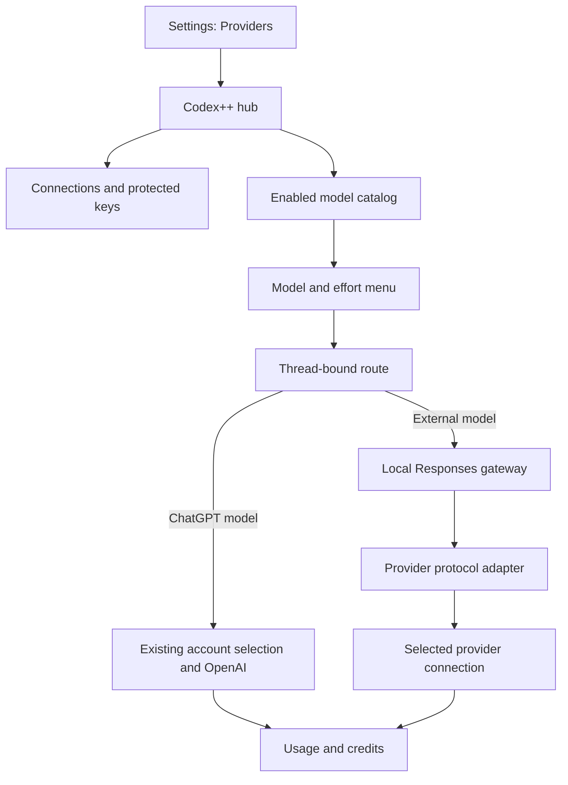

# Codex++ provider integration plan

2026-09-05. Historical design record: the initial investigation preceded implementation. Later choices superseded parts of this proposal, including the separate window and proposed module layout. See [Providers](providers.md) and the [implementation log](provider-implementation.md) for current behavior and verification.

Objective: connect multiple providers/accounts in Codex++, show models from enabled connections, select supported effort levels, and manage accounts with their own quota/balance information while preserving native ChatGPT switching and Astra.

## Measurement log: general to specific

1. **Baseline:** existing Astra compatibility changes were preserved. No product code, installer, or installed package changed during the planning investigation. Source package: 26.901.5280.0; installed app-server: 0.153.4.
2. **Reference repository:** duolahypercho/codex-router, commit `0f8441fb4a7152f4b70a4ac1709f4311f4cdde30`, package 0.5.1. Read-only review copy: `.build/codex-router-review`. Its installer was not executed. MIT permits reuse with retained copyright/license notices.
3. **Architecture:** the README describes Responses → LiteLLM → provider forwarder. src/api-forwarder.mjs attaches destination credentials at the last step. Integration requires streaming, tool calls, and protocol conversion as well as model-menu entries.
4. **Catalog and connections:** selectedConfiguredListedModels in src/provider-selection.mjs:306 intersects selected and configured providers. src/catalog.mjs:631 maps names, upstream slugs, efforts, context, modalities, and service tiers. Explicit enabling must also apply to local/keyless providers.
5. **Multiple keys and usage:** provider-api-key-pool.mjs supports quota/round-robin/fill-first strategies. provider-account-usage.mjs separates quota from monetary balance; for example, absent Anthropic balance data remains unknown while observed traffic is shown. Existing ChatGPT percentages/plan weights cannot directly represent API accounts.
6. **Codex++ contracts:** store/native are tied to ChatGPT identity; routing uses plan eligibility and quota windows; resets reads/redeems only ChatGPT codex_rate_limits credits. Patch 060 switches the local client session; 090/091/092 operate on ChatGPT routing. These boundaries require explicit handling for external providers.
7. **Upstream protocol:** schemas generated by the installed codex.exe app-server are in `.build/provider-plan-schema`. ThreadStartParams accepts modelProvider/model/config. TurnStartParams accepts model/effort but not modelProvider. Seamless cross-provider changes within a thread cannot be guaranteed; the first version should require a new chat.
8. **Official configuration:** custom providers use base_url, env_key, and wire_api=responses. model_catalog_json loads at startup; live backend catalog reload is not promised. The documented effort table lagged the local build, so Astra efforts must come from local model/list.
9. **Bundle AST:** temporary acorn/acorn-walk/prettier extracted components from Select model and supportedReasoningEfforts constants. Efforts also pass through a UI enum filter; the menu accepts modelListConfig. Evidence: `.build/astra-0905/provider-ast-index.jsonl`. Static extraction alone does not prove live rendering; P0 must measure that.
10. **Live environment:** installed CodexPP/ChatGPT.exe with separate CODEX_HOME/USER_DATA_DIR and CDP 9345. Real and test auth/account files were backed up to CodexPP-astra-0905-validation/provider-plan-backup. Only the test profile switched to Pro. Two accounts were connected, Pro and Free; the requested three-account case was a design requirement, not an observed third account.
11. **Submission observation:** real CDP input entered a prompt, but the isolated profile's Windows setup screen prevented submission; no turn/start occurred. This was not an Astra response failure. Elevated Windows setup was not performed.
12. **Real Astra response:** the installed app's existing local request client called thread/start and turn/start with an empty test work directory, read-only sandbox, approvalPolicy=never, no-tool instructions, gpt-6-astra, low effort, and standard service. An initial ephemeral turn started, but thread/read could not retrieve ephemeral turns. A second persistent turn completed with error=null, ASTRA_OK_0905, and no tools. Only the second is completion evidence; the first may also have consumed usage.
13. **Credits and limits:** forced account-specific hub GETs returned Pro 79% weekly used/21% remaining and three eligible codex_rate_limits reset credits; Free had 100% used and zero resets. Reset counts remained 3/0 after the message. These are not monetary credits per message. Exact cost and Astra-specific message capacity were not measured.
14. **Live billing page:** AST located /settings/usage; CDP opened Profile → Settings → Usage and billing. It showed Pro, $0 monetary balance, 21% weekly remaining, and the reset section. A $0 balance and three resets can coexist. This page showed the active account; an all-account selector was new scope.
15. **Screen evidence:** the DOM contained three redeem-reset buttons. The section was scrolled into view and screenshots visually checked: astra-billing-verified.png and astra-reset-credits-verified.png. No purchase/reset action was clicked. The second completed turn recorded 8,977 input, 10 output, and 8,987 total tokens; token counts are not a monetary amount or reset-credit cost.
16. **Delayed errors:** test stdout contained zero desktop_fetch_auth_401, account_info_token_unavailable, authenticatedAccountPresent=false, current_account_mismatch, ReferenceError, or TypeError events.
17. **Closure:** only the installed CodexPP process tree matching the test user-data path was closed. The initial filter also matched child processes and stopped safely; it was narrowed to the root without --type. Test auth/accounts were restored from backups. Original hashes remained unchanged; restored copies matched backups. git diff --check passed. No commit/push.

## Proposed user experience

**Settings → Providers**

- Connected providers first; the original proposal used a separate add-provider selector. The implemented version keeps the editor inline.
- Cards show connection count, status, enabled state, model count, and last check.
- Add a labeled connection with its supported authentication method, endpoint when needed, and a local masked API-key field. Keys are entered in the UI. OAuth requires a provider-specific supported flow.
- Connection testing checks access/catalog first. A paid completion test is a separate explicit action.
- Show/hide models and select supported default effort. UI and backend reject invalid effort; unsupported controls are hidden or disabled.
- Disabled connections remain manageable but leave the selection pool. Temporary network failures preserve the verified catalog, show unavailable status, and temporarily exclude the connection from automatic selection.

**Profile/account selection**

- Group connected sources by provider: ChatGPT accounts, API-key connections, and local servers.
- Show label, current selection, model eligibility, available quota/reset time or balance, update time, and errors.
- Support three or more accounts rather than a two-account limit.
- Distinguish the current chat from defaults for new chats. Selecting one connection must not reroute another active chat.
- Automatic selection chooses an eligible connection within the selected provider/model. Cross-provider or paid fallback requires an explicit future policy.

**Model menu**

- Require an enabled provider, an available connection, and explicit user visibility.
- Use provider-scoped model identities to avoid collisions; show both model and provider. The proposal used providerId:modelId; implementation uses cxp/provider/model slugs.
- Offer model-specific efforts. Locally verified Astra values: low/medium/high/xhigh/max/ultra.
- Refresh native catalog/access after ChatGPT account changes; access under one account does not establish access under another.
- If catalog changes need a restart, show that after saving without interrupting active turns. Enforce disabling/hiding at request time too.

**Usage and billing**

- Proposed all-connections and individual-account filters. The initial implementation instead places combined cards in Providers → Accounts and usage.
- Keep ChatGPT general/model windows, monetary balance, and reset credits separate.
- Show provider-reported API quota/balance when available and measured local request/token usage. Unknown and unmeasured values are not zero.
- Do not combine currencies and subscription percentages into one pool.
- Bind reset actions to the relevant ChatGPT account, with its label, credit type, and result. Do not offer ChatGPT reset actions for API accounts.

## Architectural decisions

| Topic | Decision | Reason |
|---|---|---|
| Integration | Provider management in the hub; local gateway for external traffic | Keys stay outside the renderer; streaming/cancellation remain bounded |
| Native ChatGPT | Preserve upstream transport and account hub | Limit changes to Astra/subscription behavior |
| External routing | cxp-external custom provider selected at thread creation | Only external traffic reaches the gateway; real Desktop P0 required |
| Configuration | Prefer a Codex++ app-server override | Shared config.toml and original Store/CLI routing stay intact |
| Override fallback | Design an isolated runtime home if necessary | Do not silently add a global proxy |
| Catalog | Native catalog plus enabled external metadata | Preserve honest model identities |
| Protocols | Responses passthrough first; separately verify Chat/Messages adapters | Compatibility claims do not prove tools or compaction |
| Reference reuse | Selective registry/adapter reuse with MIT attribution | Avoid importing the entire Control Center/tray/installer/Python stack |
| Subscription bridges | Separate later phase | Official-client bridges are not equivalent to API keys |
| Secrets | OS-protected storage; public status/reference only | New keys stay outside plaintext accounts and logs |
| Multiple keys | Per-connection health/quota/cooldown and thread pinning | One connection's auth/quota failure must not disable the provider |

The initial child-process override proposal was superseded by a verified thread/start.config override during P0.



Initially proposed modules were providers.cjs (CRUD/public metadata), provider-secrets.cjs (OS protection), provider-catalog.cjs (capabilities/versioned catalog), provider-routing.cjs (eligibility/thread routes), provider-usage.cjs (reported and observed usage), and router/ (streaming/adapter lifecycle). Implementation consolidated some of these responsibilities; see ARCHITECTURE.md.

Minimum design contract:

```text
Provider: id, label, protocol, endpoint, enabled, capabilities
Connection: id, providerId, label, authType, credentialRef, enabled, status, checkedAt
Model: id, providerId, upstreamId, label, visible, efforts[], defaultEffort,
       tools, images, contextWindow, compaction, source, checkedAt
Usage: connectionId, kind(quota|balance|resetCredits|observedUsage), unit,
       value?, limit?, remaining?, resetsAt?, source, fetchedAt, error?
ThreadRoute: hostId, threadId, providerId, connectionId, modelId, mode(manual|auto)
```

Use versioned connection metadata and protected credentials, with backed-up/idempotent migrations if needed. The gateway binds only to loopback and authenticates local callers with a random credential. Only the selected provider key reaches the external endpoint; ChatGPT bearer/account headers do not. Changing an endpoint must not silently forward the old key to a new host. Do not automatically retry/switch accounts after streaming starts: that risks duplicate billing or tool actions. Deleting an active connection must produce a clear error and user choice.

## Delivery phases and acceptance criteria

| Phase | Deliverable | Required evidence |
|---|---|---|
| P0: compatibility spike | Local mock Responses provider, native Astra and external model, configuration override | Real Desktop model/effort rendering, routed mock request, native Astra completion, resumed routing, unchanged original config/hashes |
| P1: connections | Settings, protected keys, enable/disable, access test | Three mock connections, hidden/rejected disabled models, restart/migration recovery |
| P2: initial models | Responses/OpenRouter adaptation and local Ollama/LM Studio capability experiments | Text stream, tool/result/follow-up, cancellation, errors, context bounds, correct effort |
| P3: accounts/usage | Account selection and multi-key automatic selection | Manual three-account selection; full/unknown/stale quotas; 401/429; concurrent-thread isolation; provider comparison |
| P4: expansion | Messages and requested adapters/bridges | Provider-specific protocol/auth/capability matrix; no verified badge without critical-flow tests |

The user added API-key-based **OpenCode Go** to the first-provider scope. At planning time no user key was connected, so paid-provider completion was not yet verified. Later live results are recorded in the implementation log.

The [official Go documentation](https://opencode.ai/docs/go/) supports subscription API keys in other coding agents. The reference opencode config maps Go Responses/Chat/Messages variants to the same key family. Go subscription and metered Zen must remain explicit separate choices; shared key compatibility does not enable Zen automatically. Show enabled models available to the connected account and verified efforts. Identify the client as Codex++ and send the documented stable per-chat x-opencode-session header. Show limits only when verified through the endpoint/headers; otherwise retain unknown. Acceptance includes real text/tool/follow-up, effort conversion, quota errors, and no silent Zen fallback.

P0 subsequently passed with the real app-server/Desktop and a local mock, without impersonating native GPT slugs. The initial implementation supports Chat/Responses model changes on the same connection/protocol when context does not shrink. Messages model changes and cross-provider/protocol changes need a new chat. Per the user's later UI decision, Providers now appears within Settings directly below Analytics.

## Expected impact on existing patches

| Patches | Planned impact |
|---|---|
| 010/070/080 | Preserve native authentication; never present API keys as ChatGPT tokens |
| 020/030/050 | Gateway lifecycle, narrow IPC, private runtime configuration |
| 040/111 | Account/provider selection surfaces |
| 060/090 | Separate native sessions from external routes; skip ChatGPT plan eligibility for external models |
| 091/092 | Scope failures to provider/connection/model; no automatic cross-provider fallback |
| 100/101 | Preserve account-specific ChatGPT reset credits |
| New settings/catalog patches | Settings route, usage selection, catalog binding with semantic anchors, unique matches, and markers |

These are planning boundaries, not a list of already-applied new patches.

## Sources and local evidence

- [Reference snapshot](https://github.com/duolahypercho/codex-router/tree/0f8441fb4a7152f4b70a4ac1709f4311f4cdde30)
- [MIT license](https://github.com/duolahypercho/codex-router/blob/0f8441fb4a7152f4b70a4ac1709f4311f4cdde30/LICENSE)
- [Provider selection](https://github.com/duolahypercho/codex-router/blob/0f8441fb4a7152f4b70a4ac1709f4311f4cdde30/src/provider-selection.mjs)
- [Catalog](https://github.com/duolahypercho/codex-router/blob/0f8441fb4a7152f4b70a4ac1709f4311f4cdde30/src/catalog.mjs)
- [API-key pool](https://github.com/duolahypercho/codex-router/blob/0f8441fb4a7152f4b70a4ac1709f4311f4cdde30/src/provider-api-key-pool.mjs)
- [Usage metrics](https://github.com/duolahypercho/codex-router/blob/0f8441fb4a7152f4b70a4ac1709f4311f4cdde30/src/provider-account-usage.mjs)
- [Official OpenAI configuration reference](https://learn.chatgpt.com/docs/config-file/config-reference)
- `.build/astra-0905/astra-message-result.json`: completed real Astra turn.
- `.build/astra-0905/astra-credits-after.json`: account-specific quota/reset query after the message.
- `.build/astra-0905/provider-ast-index.jsonl` and readable/: AST findings.
- `.build/provider-plan-schema/v2/ThreadStartParams.json` and TurnStartParams.json: actual installed-binary schemas.
