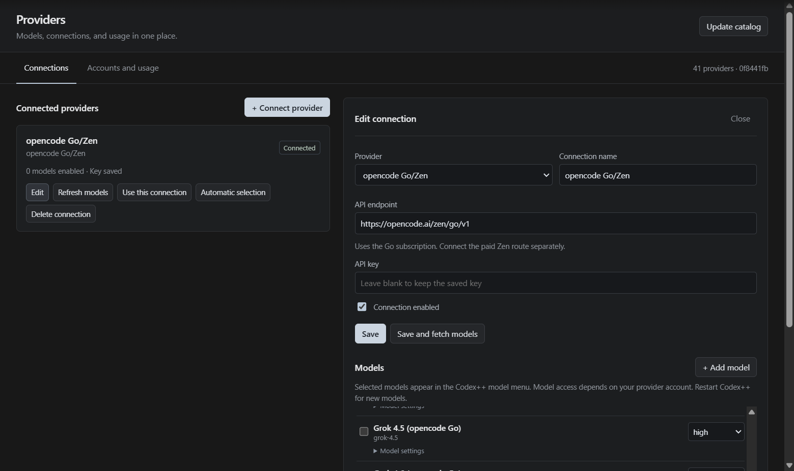

# Providers

Initial integration for Windows 26.901.5280.0. Open **Settings → Providers**, directly below Analytics. The content appears within Settings.

The screenshot shows the installed panel with an empty API-key input. Selected models depend on the user's saved preferences.

## Add a connection

1. Click **Connect provider** and choose a provider from the catalog.
2. Name the connection and enter your API key in the form.
3. Click **Save and fetch models** to check model-list access with that endpoint and key.
4. Enable the models you want to show, choose a supported default effort, and save.
5. Restart Codex++. Selected models from enabled connections appear with their provider name in the model menu.

You can add multiple accounts or keys for one provider. **Use this connection** selects the connection for new chats. Automatic selection chooses an available connection by its last-use time. Existing chats stay pinned to their connection; changing the default does not change their account. Disabled or deleted connections produce an explicit error.

### Connected provider missing from the model menu

A saved connection alone does not enable its models. If the card shows **0 models enabled**, open **Edit**, check the models you want, and click **Save**. Restart Codex++ to reload the model catalog. In the composer, open the current model control and then **Select model** to expand the full list. The list has its own scrollbar.

The connection must be enabled and have completed model discovery. Each model must also be enabled and supported. These checks are applied before its entry reaches the Desktop model catalog.

## Update the catalog

**Update catalog** fetches current config JSON from [codex-router](https://github.com/duolahypercho/codex-router). The initial snapshot, `0f8441fb4a7152f4b70a4ac1709f4311f4cdde30`, contains 37 providers and 175 models; local and custom fallbacks bring the selector to 41 provider options. Updates preserve keys, endpoints, and connection selections. **Refresh models** applies new catalog metadata to a connection; new models start disabled. Use **Add model** and **Model ID (API)** for a model missing from the API list.

Downloaded code is never executed. The source is pinned to a SHA, its MIT license is checked, and only JSON data is read. Attribution is preserved in `hub/PROVIDER-CATALOG-LICENSE.txt`. Catalog membership does not mean that a provider has passed a live paid-account test in Codex++. Connections or models requiring OAuth, subscription bridges, or special protocols are marked as requiring an adapter.

## Go, effort, and usage

OpenCode Go and the metered Zen service are separate connections. There is no automatic Go-to-Zen fallback. Go [officially supports API keys in other coding agents](https://opencode.ai/docs/go/). Codex++ sends its own client identity and a stable `x-opencode-session` header for each chat.

**Accounts and usage** lists ChatGPT accounts and API connections together. ChatGPT quota windows and reset credits come from the existing account service. Go remaining-quota percentages come from its `/usage` endpoint. Quota or balance unavailable from the endpoint is shown as **Unknown**. Local token counters are neither the provider account's total usage nor its monetary balance.

Adapters support Responses, Chat Completions, and Messages streams. Chat/Responses models can change within the same connection and protocol if the context window does not shrink. A different provider, different protocol, smaller context window, or Messages model change requires a new chat. Effort choices are restricted to those declared by the model; unsupported effort is not silently remapped. Messages thinking budgets are not inferred without verified catalog metadata.

Desktop function/custom tools inside namespaces are converted for Chat and Messages; results and history map back to the original tool name and namespace. OpenAI's hosted web search is disabled for Chat/Messages because these protocols do not provide that tool. Other supported client tools remain available. Long model lists scroll within their own area; the outer panel also scrolls in smaller windows.

External models currently lack native `apply_patch` in their app-server tool inventory; file editing works through the command tool. See the [tool verification matrix](provider-tools-and-usage-0905.md) for actual file read/write, search, terminal-session, and image results. MiniMax issued dependent writes concurrently in one test, producing incorrect file contents. Reliable operation ordering is not claimed for every model.

## Storage and validation

On Windows, API keys are encrypted with DPAPI CurrentUser. This Codex build lacks Electron's native safeStorage module. The fixed PowerShell DPAPI call carries data only through pipes; keys are not placed in command-line arguments, environment variables, or temporary files. Other platforms require an available secure Electron backend. There is no plaintext fallback.

The gateway binds only to loopback, with a random port and credential. Thread configuration contains only the local route. External requests do not receive ChatGPT bearer or account headers. Once streaming starts, a request is not automatically replayed against another account. External authentication/quota errors do not change native ChatGPT authentication or eligibility.

Validation includes `node --test tools/test-providers.cjs`, patch/syntax checks against the real Store ASAR, and completed messages through an isolated Desktop request client. On 2026-09-05, the user's saved Go connection passed live messages across three protocols, Chat/Messages namespace tool round trips, low/high effort, and usage-endpoint checks. A Desktop DeepSeek V4 Flash turn completed with `error=null`. This does not certify every catalog provider. See the [implementation log](provider-implementation.md).
